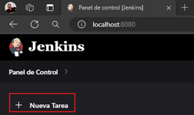
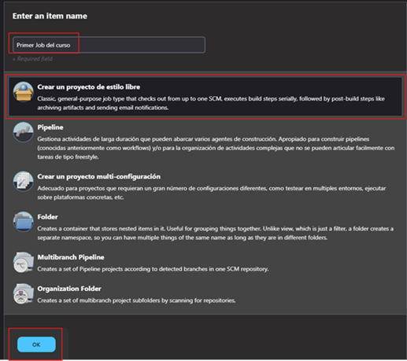
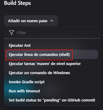
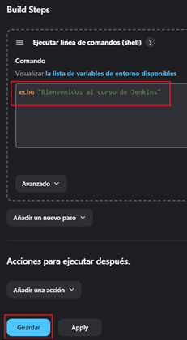
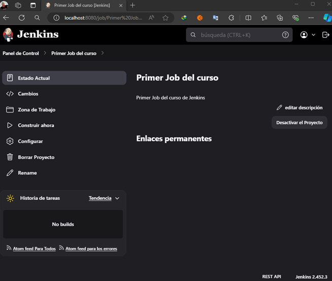
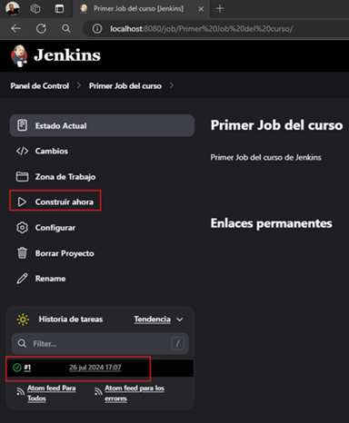
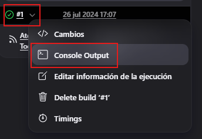
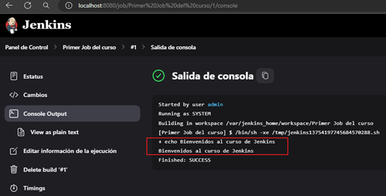
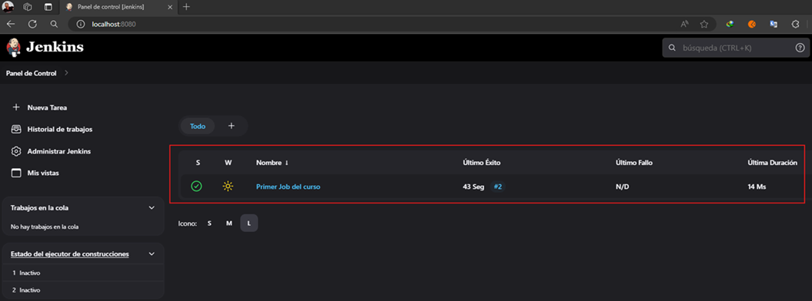

# Empecemos con Jenkins

---

## Arquitectura de Jenkins

Los `Jenkins Job` son tareas ejecutables que son supervisadas y controladas por Jenkins. Lo que se busca con los jobs
es automatizar las tareas. *Por ejemplo, supongamos que tenemos que desplegar una aplicación a la nube,
como Google Cloud o Azure, podemos programar un Job para automatizar esta tarea.*

### Master and Slave (maestro y esclavo)

El `master` es el mismo `Jenkins` y cumple las siguientes tareas:

- Encargado de programar el `Build Job`.
- Envía la compilación al esclavo para que se haga efectiva la ejecución del Job.
- Supervisar el trabajo del esclavo y registrar los resultados del Build.
- Ejecutar los Build Jobs que el maestro le ha enviado.

El `slave` o también llamado `node`, son máquinas programadas para construir los proyectos que el maestro lo requiere.

`Jenkins` ejecuta programas separados, que son llamados `agentes esclavos` dentro de los esclavos. Cuando el maestro
registra los esclavos, empieza a enviar y elegir las tareas para cada esclavo.

### Jenkins Executor

Es una secuencia separada de compilaciones que se ejecutarán en un nodo en paralelo. Un nodo o slave puede tener uno
o más ejecutores.

### Plugins de Jenkins

Un plugin de `Jenkins` es una parte de software adicional a la funcionalidad básica del `Jenkins Server`.

## Primer Job de Jenkins

Para crear el primer Job vamos a la opción `Nueva Tarea`:

Escribimos un nombre para nuestro Job y seleccionamos el tipo `Crear un proyecto de estilo libre`:

Luego de darle `OK` nos aparecerá la ventana del trabajo, donde en el primer cuadro de descripción le agregamos un texto
descriptivo, en mi caso le agregaré `Primer Job del curso de Jenkins`.

A continuación nos vamos al final de la página y en la sección `Build Steps` seleccionamos `Ejecutar línea de comandos
(shell)`

Se nos abrirá una sección donde podremos escribir nuestros comandos, esta ventana es como si fuera una línea de
comandos `(un shell)` donde ingresaremos los comandos a ser ejecutados. En este caso escribiremos el comando para
imprimir un mensaje.

Luego de dar clic en el botón `Guardar` nos muestra la siguiente página correspondiente a la página del proyecto que
hemos creado.

Para ejecutar el job, debemos dar click en `Construir ahora`, veremos que nos aparece una ejecución exitosa en la parte
inferior junto a la fecha cuando se ejecutó.

Damos clic en la flecha y seleccionamos `Console Output`.

Vemos en la salida de la consola el mensaje que escribimos en la línea de comandos.

**Nota**
> Lo que hace `Jenkins` por debajo es crearnos un script en `bash` con lo que nosotros le brindamos en la `shell`, lo
> coloca en un archivo temporal y lo ejecuta.

Finalmente, si vamos al panel de control veremos los detalles de la ejecución de nuestro job, hace cuánto se realizó una
ejecución exitosa, el número de veces realizado (en este caso realizamos una ejecución adicional dándole clic en el
botón `Contruir ahora`), el último fallo y la duración de la ejecución.

