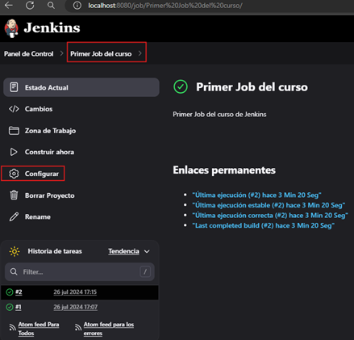
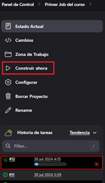

# Empecemos con Jenkins

---

## Arquitectura de Jenkins

Los `Jenkins Job` son tareas ejecutables que son supervisadas y controladas por Jenkins. Lo que se busca con los jobs
es automatizar las tareas. *Por ejemplo, supongamos que tenemos que desplegar una aplicación a la nube,
como Google Cloud o Azure, podemos programar un Job para automatizar esta tarea.*

### Master and Slave (maestro y esclavo)

El `master` es el mismo `Jenkins` y cumple las siguientes tareas:

- Encargado de programar el `Build Job`.
- Envía la compilación al esclavo para que se haga efectiva la ejecución del Job.
- Supervisar el trabajo del esclavo y registrar los resultados del Build.
- Ejecutar los Build Jobs que el maestro le ha enviado.

El `slave` o también llamado `node`, son máquinas programadas para construir los proyectos que el maestro lo requiere.

`Jenkins` ejecuta programas separados, que son llamados `agentes esclavos` dentro de los esclavos. Cuando el maestro
registra los esclavos, empieza a enviar y elegir las tareas para cada esclavo.

### Jenkins Executor

Es una secuencia separada de compilaciones que se ejecutarán en un nodo en paralelo. Un nodo o slave puede tener uno
o más ejecutores.

### Plugins de Jenkins

Un plugin de `Jenkins` es una parte de software adicional a la funcionalidad básica del `Jenkins Server`.

## Primer Job de Jenkins

Para crear el primer Job vamos a la opción `Nueva Tarea`:


Escribimos un nombre para nuestro Job y seleccionamos el tipo `Crear un proyecto de estilo libre`:


Luego de darle `OK` nos aparecerá la ventana del trabajo, donde en el primer cuadro de descripción le agregamos un texto
descriptivo, en mi caso le agregaré `Primer Job del curso de Jenkins`.

A continuación nos vamos al final de la página y en la sección `Build Steps` seleccionamos `Ejecutar línea de comandos
(shell)`


Se nos abrirá una sección donde podremos escribir nuestros comandos, esta ventana es como si fuera una línea de
comandos `(un shell)` donde ingresaremos los comandos a ser ejecutados. En este caso escribiremos el comando para
imprimir un mensaje.


Luego de dar clic en el botón `Guardar` nos muestra la siguiente página correspondiente a la página del proyecto que
hemos creado.


Para ejecutar el job, debemos dar click en `Construir ahora`, veremos que nos aparece una ejecución exitosa en la parte
inferior junto a la fecha cuando se ejecutó.


Damos clic en la flecha y seleccionamos `Console Output`.


Vemos en la salida de la consola el mensaje que escribimos en la línea de comandos.


**Nota**
> Lo que hace `Jenkins` por debajo es crearnos un script en `bash` con lo que nosotros le brindamos en la `shell`, lo
> coloca en un archivo temporal y lo ejecuta.

Finalmente, si vamos al panel de control veremos los detalles de la ejecución de nuestro job, hace cuánto se realizó una
ejecución exitosa, el número de veces realizado (en este caso realizamos una ejecución adicional dándole clic en el
botón `Contruir ahora`), el último fallo y la duración de la ejecución.


## Modificando comando del Job

Estando dentro de nuestro job `Primer Job del curso` vamos a la opción de `Configurar` para editar el comando que
agregamos al `shell`.



A continuación nos dirigimos a la sección de la shell y cambiamos el comando por uno que nos imprima la fecha en un
formato:


Luego de dar en guardar vamos al job `Primer Job del curso` y damos clic en la opción `Confstruir ahora`. Ingresamos
a la nueva construcción que será `#3 26 jul 2024 18:14` y vemos en la opción de `Console Output` el comando que se está
ejecutando.


## Agregando variables a nuestro Job

Vamos a crear en nuestra línea de comandos una variable llamada `AHORA`. Esta variable recibirá como valor una fecha en
formato am/pm gracias al `%r` (Por ejemplo: 06:24:43 PM). Luego crearemos una cadena y concatenaremos nuestra variable
que posteriormente lo estaremos guardando en un archivo llamado `ahora` dentro del directorio `/temp`.


A continuación, damos clic en `guardar`, luego en `construir ahora` y finalmente vemos el resultado en la consola.


El resultado anterior, nos lo tiene que haber colocado también dentro del directorio `/tmp` en el archivo `ahora` dentro
del contenedor de jenkins, así que ingresamos al contenedor y observamos que tenemos ese resultado esperado.

````bash
docker container exec -it c-jenkins /bin/sh
$ ls
bin  boot  dev  etc  home  lib  lib64  media  mnt  opt  proc  root  run  sbin  srv  sys  tmp  usr  var
$ cd tmp
$ ls
ahora               jetty-0_0_0_0-8080-war-_-any-14132310332811285472  jetty-0_0_0_0-8080-war-_-any-5517052436123785000  winstone5093919119483618643.jar
hsperfdata_jenkins  jetty-0_0_0_0-8080-war-_-any-16321872792827749513  winstone2246336850697483124.jar                   winstone5660314753834493265.jar
$ cat ahora
La hora actual es: 06:31:06 PM
````

## Nuevamente, modificamos el comando del job

Vamos a modificar el comando del job que habíamos escrito anteriormente para crear un `script de shell` algo más
complejo.


A continuación describo brevemente algunas partes del `script de shell` donde considero podría haber confusión:

- La línea `#!/bin/sh` al principio de un archivo se llama `shebang` o `hashbang`. Es usada en sistemas `Unix`
  y `Unix-like` para indicar el intérprete de ejecución y la ruta hacia el intérprete `Bourne Shell (sh)`. Es una
  secuencia de caracteres que le dice al sistema operativo con qué intérprete debe ejecutar el script. En este
  caso, `#!/bin/sh` indica que el script debe ser ejecutado usando el intérprete `Bourne Shell (sh)`. Esto es útil
  porque asegura que el script se ejecute con el intérprete correcto, independientemente del shell predeterminado del
  usuario. Sin el `shebang`, tendríamos que ejecutar el script especificando el intérprete
  manualmente: `bash mi_script.sh`.


- `do`, marca el comienzo del bloque de código que se ejecutará en cada iteración del bucle.


- `fi`, finaliza el bloque `if`.

A continuación vamos a ejecutar el job dando clic en el botón `Construir ahora`. Observemos que como estamos haciendo
uso de `sleep's` para dormir el flujo de ejecución, en la parte inferior vemos una barra que se va a ir cargando en
función a los tiempos con el que estamos trabajando.



Al finalizar la construcción del job, nos iremos a la salida de la consola para observar que los datos están
imprimiéndose correctamente según lo que hemos colocado en el script. Notar que estamos haciendo uso correcto de la
impresión de las variables.


**Nota**
> En mi caso estoy usando la siguiente sintaxis para utilizar una variable `${nombre}`, pero en el tutorial está
> haciendo uso de esta otra sintaxis `$nombre`. Ambas formas funcionan, en lo particular prefiero usar la primera forma.
>
> En mi caso estoy haciendo uso del `#!/bin/sh`, indica que el script debe ser ejecutado por el `Bourne Shell (sh)`,
> que es más básico y menos avanzado. Tiene un conjunto de características más limitado en comparación con Bash. Hace
> que el script sea más portátil y compatible con diferentes sistemas Unix y Unix-like, ya que sh está presente en
> prácticamente todos ellos.
>
> En el tutorial se hace uso del `#!/bin/bash`, indica que el script debe ser ejecutado por `Bash (Bourne Again SHell)`,
> que es un shell más avanzado y rico en características. Soporta `funciones`, `arrays`, `globbing avanzado`,
> `autocompletado` de comandos, mejoras en el manejo de errores, y muchas más características avanzadas.
> Permite el uso de estructuras de control más complejas y sintaxis más rica (como `[[ ]]`, que ofrece comparación de
> cadenas mejorada).
>
> En mi caso, para este script, opté por usar el `#!/bin/sh`.

