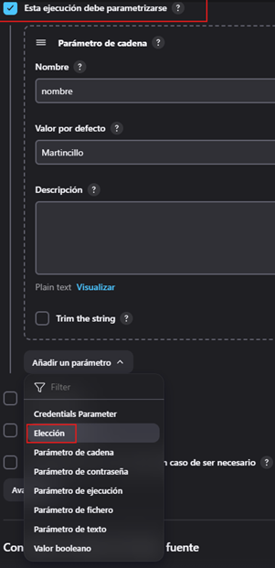
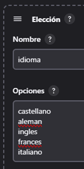
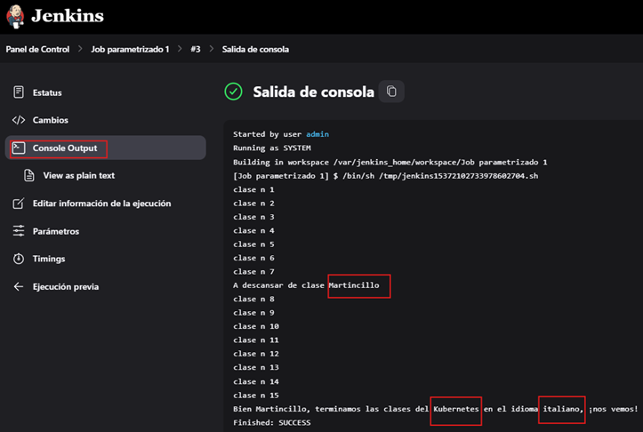

# Parametrizando Jenkins Jobs

---

## Agregando parámetros

Iniciaremos creando una nueva vista. Para eso damos clic en el ícono del más.


Le asignamos un nombre, seleccionamos `Lista de vistas` y le damos en `Create`.


Se nos abrirá una nueva pantalla donde le agregamos una pequeña descripción y le damos en `OK`.


En el panel principal veremos la nueva vista creada. Notar que tenemos también la vista `Todo`, en esa vista estarán
todos los jobs creados, mientras que en la vista que acabamos de crear estará únicamente el job que creemos para dicha
vista.


Ahora, estando en la vista que hemos creado, vamos a crear una nueva tarea.


Le damos un nombre al nuevo job que estamos a punto de crear.


Luego de haberle dado en ok, seremos redireccionados a la siguiente pantalla donde agregaremos ciertas configuraciones
para las ejecuciones antiguas.


Luego, en el apartado de `Build Steps` seleccionamos la opción para ejecutar scripts mediante la línea de comando.


Nos vamos a la opción para escribir comandos y utilizaremos el mismo script que usamos al final de la sección anterior.
Recordemos que en la sección anterior (`empecemos con jenkins`) agregamos un script hacia dentro del contenedor de
jenkins, en el directorio `opt`. El script que ingresamos en el contenedor se llamaba `jobscript.sh`.

Recordemos además, que el script `jobscript.sh` está utilizando variables, mismas que le pasaremos en esta oportunidad
utilizando el propio jenkins.


Volvemos hacia arriba de este formulario y damos check a la opción `Esta ejecución debe parametrizarse`, luego
seleccionamos el añadir `parámetros de cadena`, dado que las variables que el script que estamos por ejecutar está
esperando valores de tipo `String`. Recordemos que las variables son `nombre` y `curso`.


Definimos el nombre de la variable `nombre` y su correspondiente valor.


Lo mismo hacemos para la siguiente variable `curso`.


Luego de haber dado en `Guardar`, nos aparecerá esta ventana. Le damos clic en la opción `Build with Parameters` y
en automático nos aparecerá el formulario de la derecha donde podemos cambiar los valores de las variables que hemos
definido anteriormente. En nuestro caso ejecutaremos con las mismas variables que hemos definido.


Luego, nos vamos a la opción de la ejecución de nuestro nuevo job y observamos la salida en consola. Observemos que las
valores se está imprimiendo correctamente.


## Parámetros de elección

En este apartado modificaremos el job `Job parametrizado 1`. Nos vamos a la sección de configuración y modificamos el
script.

Recordemos que en el apartado anterior habíamos usado el archivo que estaba dentro del contenedor de jenkins, en este
caso habíamos definido en el cuado de comando la ruta `/opt/jobscript.sh`. En este apartado, copiaremos el script de
dicho archivo para pegarlo directamente en el cuadro de comando y haremos una pequeña modificación agregando una
nueva variable llamada `idioma`.


Luego, nos vamos hacia la parte superior y en la opción de `Esta ejecución debe parametrizarse` eliminamos el parámetro
de `curso` y volvemos a añadir un nuevo parámetro pero esta vez seleccionando `Elección`.



A continuación volvemos a ingresar el nombre de la variable `curso`, pero esta vez en opciones le daremos las distintas
opciones que el usuario tendrá para elegir antes de ejecutar el job.


Hacemos lo mismo con el la nueva variable `idioma`.



Ahora, damos en la opción de guardar y en la pantalla de job le damos en `Build with Parameters`. En automático se
creará la vista derecha mostrándonos las variables y los valores que podemos usar. Notar que para las variables `curso`
y `idioma` ya no tenemos la posibilidad de ingresar valores, sino más bien, estamos limitados a seleccionar opciones de
una lista desplegable.


Luego, si ejecutamos el job y nos vamos a la opción de salida en consola veremos que los valores que hemos elegido para
las variables se está imprimiendo correctamente.



## Parámetro booleano

Para este apartado vamos a crear un nuevo `job` dentro de la vista `Jobs Parametrizados`.


Le agregamos un nombre a nuestro nuevo job.


En el apartado de `Desechar ejecuciones antiguas` definiremos el número de días que estarán nuestras ejecuciones
almacenadas (5) y además el número máximo de ejecuciones que tendremos almacenados (3).


Es decir, esto significa que si definimos como `3` el número máximo de ejecuciones almacenadas, siempre existirán
las `3` últimas ejecuciones visibles en el historial, es por eso que no vemos la ejecución `#1`.


A continuación seleccionamos la opción para agregar nuestro nuevo script.


El script ingresado tendrá estará esperando recibir valores para 3 variables: `planeta`, `agente` y `nombre`.


El script en código sería el siguiente.

````bash
#!/bin/sh
echo "Bienvenido al planeta ${planeta}"
if [ "${agente}" = "true" ] 
then
	echo "Prepárese para la misión agente X, que la fuerza te acompañe."
else
	echo "Disfruta el planeta humano ${nombre}, trata de no morir"
fi
echo "..."
sleep 10
echo "¡Suerte! La necesitarás."
````

Luego, buscamos la opción para definir los 3 parámetros. Iniciamos agregando un parámetro de cadena.


Agregamos la variable `nombre`.


Procedemos a agregar una nueva variable, pero esta vez será de `Elección` para definir un conjunto de valores para
dicha variable.


Definimos la variable `planeta` y en las opciones la lista de planetas disponibles.


Agregamos un nuevo parámetro, pero esta vez su valor será un `booleano`.


La variable booleana será `agente`. Notar que no hemos dado `check` en el cuadro `Valor por defecto`, eso significa que
tomará el valor de `false`.


Ahora, damos en guardar y vamos a ejecutar el job. Establecemos los valores a las variables definidas y damos clic en
el botón `Ejecución`.


A continuación veremos los resultados en la parte inferior, seleccionamos `Console Output`.


Verificamos que la salida en la consola corresponde con los valores que hemos definido a los parámetros.


Volvemos a construir el job, pero esta vez con nuevos valores para los parámetros.


Al ejecutar el job, vemos nuevamente los resultados según los parámetros que hemos elegido.


