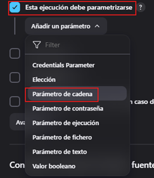

# Parametrizando Jenkins Jobs

---

## Agregando parámetros

Iniciaremos creando una nueva vista. Para eso damos clic en el ícono del más.

Le asignamos un nombre, seleccionamos `Lista de vistas` y le damos en `Create`.

Se nos abrirá una nueva pantalla donde le agregamos una pequeña descripción y le damos en `OK`.

En el panel principal veremos la nueva vista creada. Notar que tenemos también la vista `Todo`, en esa vista estarán
todos los jobs creados, mientras que en la vista que acabamos de crear estará únicamente el job que creemos para dicha
vista.

Ahora, estando en la vista que hemos creado, vamos a crear una nueva tarea.

Le damos un nombre al nuevo job que estamos a punto de crear.

Luego de haberle dado en ok, seremos redireccionados a la siguiente pantalla donde agregaremos ciertas configuraciones
para las ejecuciones antiguas.

Luego, en el apartado de `Build Steps` seleccionamos la opción para ejecutar scripts mediante la línea de comando.

Nos vamos a la opción para escribir comandos y utilizaremos el mismo script que usamos al final de la sección anterior.
Recordemos que en la sección anterior (`empecemos con jenkins`) agregamos un script hacia dentro del contenedor de
jenkins, en el directorio `opt`. El script que ingresamos en el contenedor se llamaba `jobscript.sh`.

Recordemos además, que el script `jobscript.sh` está utilizando variables, mismas que le pasaremos en esta oportunidad
utilizando el propio jenkins.

Volvemos hacia arriba de este formulario y damos check a la opción `Esta ejecución debe parametrizarse`, luego
seleccionamos el añadir `parámetros de cadena`, dado que las variables que el script que estamos por ejecutar está
esperando valores de tipo `String`. Recordemos que las variables son `nombre` y `curso`.

Definimos el nombre de la variable `nombre` y su correspondiente valor.

Lo mismo hacemos para la siguiente variable `curso`.

Luego de haber dado en `Guardar`, nos aparecerá esta ventana. Le damos clic en la opción `Build with Parameters` y
en automático nos aparecerá el formulario de la derecha donde podemos cambiar los valores de las variables que hemos
definido anteriormente. En nuestro caso ejecutaremos con las mismas variables que hemos definido.

Luego, nos vamos a la opción de la ejecución de nuestro nuevo job y observamos la salida en consola. Observemos que las
valores se está imprimiendo correctamente.

