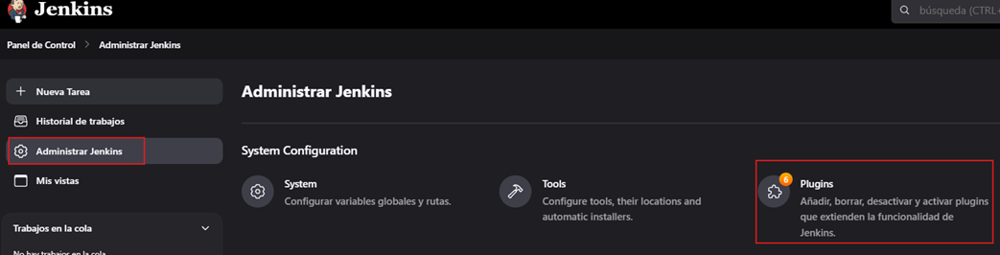
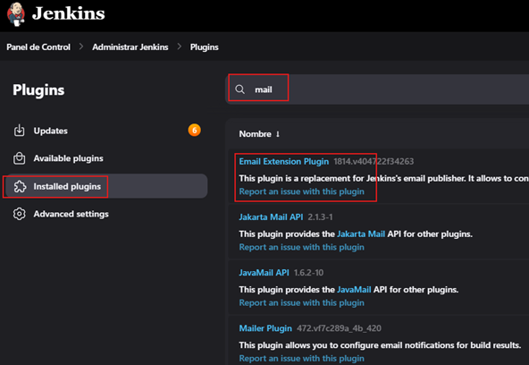

# Integración Email y Slack

---

- El objetivo es para alertar al desarrollador lo antes posible de una construcción no satisfactoria (`broken build`).
- Incrementa la productividad del equipo de desarrollo en un porcentaje alto.
- Cuando no se puede estar atento a todos los jobs que se ejecutan, es donde verdaderamente influye su gran utilidad.
- Jenkins realiza un pull al control de versión cada X tiempo.
- El sistema de control de versión envía una notificación a Jenkins.

## Instalación del email plugin

Por defecto, cuando instalamos `Jenkins` se nos instala el plugin de email. Para verificarlo podemos ir a la siguiente
opción.

Luego, buscamos por `mail` en `installed plugins` y veremos que efectivamente lo tenemos instalado.

