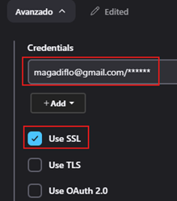
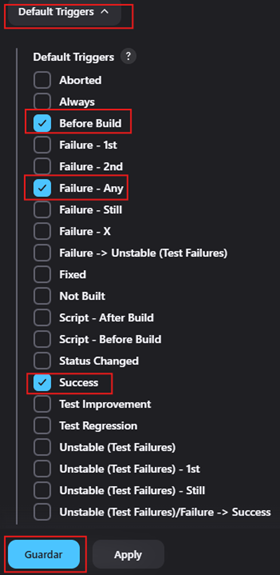

# Integración Email y Slack

---

- El objetivo es para alertar al desarrollador lo antes posible de una construcción no satisfactoria (`broken build`).
- Incrementa la productividad del equipo de desarrollo en un porcentaje alto.
- Cuando no se puede estar atento a todos los jobs que se ejecutan, es donde verdaderamente influye su gran utilidad.
- Jenkins realiza un pull al control de versión cada X tiempo.
- El sistema de control de versión envía una notificación a Jenkins.

## Instalación del email plugin

Por defecto, cuando instalamos `Jenkins` se nos instala el plugin de email. Para verificarlo podemos ir a la siguiente
opción.

Luego, buscamos por `mail` en `installed plugins` y veremos que efectivamente lo tenemos instalado.

## Email con Gmail

El primer paso es crear una contraseña para nuestra cuenta de `gmail`. Para crear la contraseña debemos seguir una
serie de pasos, seguir esta guía donde explico paso a paso cómo crear una contraseña para una aplicación
[spring-boot-email](https://github.com/magadiflo/spring-boot-email?tab=readme-ov-file#creando-contrase%C3%B1a-de-aplicaci%C3%B3n-gmail)

Como siguiente paso vamos a configurar el servidor de correo.

Notar que en el campo `contraseña` hemos agregado la contraseña que nos debió generar `gmail` al seguir los pasos de la
creación de contraseña.

Como observamos, nos ha llegado un correo de prueba, eso significa que la configuración anterior ha sido exitoso.

Ahora, realizamos la configuración en la opción de `Extended E-mail Notification`.

Luego de selección la opción `Jenkins` nos aparecerá este cuadro de diálogo donde agregaremos nuestro correo y la
contraseña generada por gmail.

Luego le damos en guardar, seleccionamos el correo que acabamos de agregar y seleccionamos la opción `Use SSL`.

En el apartado de `Default Triggers` seleccionamos los lanzadores por defecto, es decir cuándo se enviarán los correos.

Ahora, nos vamos al primer job que creamos `Primer Job del curso`, seleccionamos `configurar`.

Nos vamos a la parte inferior, casi en la sección donde colocamos los scripts. En el desplegable seleccionamos la
acción `Editable Email Notification`.

A continuación colocamos nuestro correo como parte de la lista de destinatarios del proyecto.

Finalmente, nos posicionamos en el job que acabamos de configurar y le damos en construir ahora.

Finalizada la construcción del job, veremos que al correo nos ha llegado un mensaje donde nos dice que el job #19 se ha
construido.

