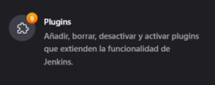
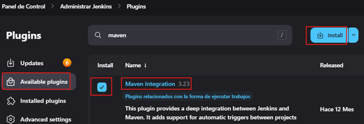
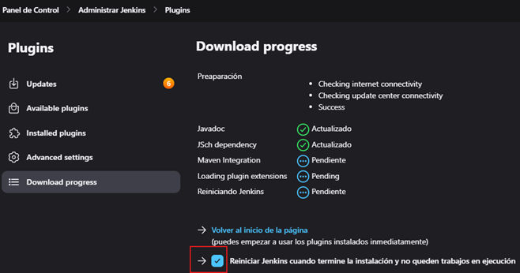
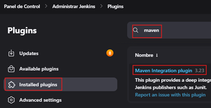
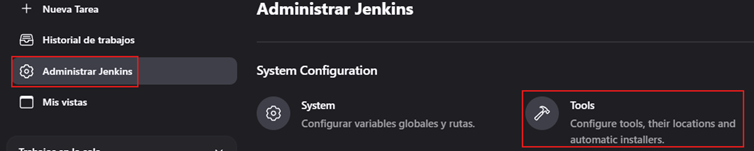
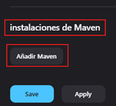
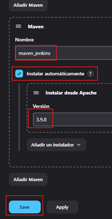

# Java Maven App

---

En esta sección veremos cómo lograr la `integración continua` en `Jenkins` con `Maven` y `Java`.

### Pasos para el flujo con la integración continua con Jenkins para la construcción de un job normal

1. Instalación de plugins y configuración.
2. Pull del repositorio de maven app en jenkins.
3. Realizar el build (construcción) de la aplicación.
4. Realizar tests sobre el build.
5. Ejecutar la app.

## Instalación de plugins y configuración

Vamos a instalar `Maven`, así que nos vamos a la opción de `Administrar Jenkins`.

Seleccionamos la opción de `Plugins`.

En la opción de `Available plugins` buscamos `maven`, damos check a la opción `Maven Integration` y procedemos a
instalar presionando el botón `install`.

Se empezará a descargar el plugin de `maven`. Debemos dar check a la opción de reiniciar Jenkins.

Al finalizar, verificamos que el plugin de `maven` se ha instalado correctamente, esto lo podemos ver en la opción
de `installed plugins`.

Ahora, necesitamos agregar maven a nuestro jenkins, es decir asociarlo a jenkins. Para eso nos vamos a la opción de
`administrar jenkins` y seleccionamos la opción de `Tools`.

Nos dirigimos a la parte inferior y buscamos la opción `instalaciones de Maven` y damos en `Añadir Maven`.

En la ventana que se muestra ingresaremos un nombre cualquiera, en nuestro caso se llamará `maven_jenkins`, damos check
a `Instalar automáticamente` y dejamos la versión que viene por defecto. Finalmente, damos en `Save`.

