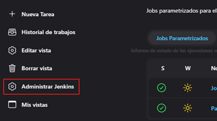

# Java Maven App

---

En esta sección veremos cómo lograr la `integración continua` en `Jenkins` con `Maven` y `Java`.

### Pasos para el flujo con la integración continua con Jenkins para la construcción de un job normal

1. Instalación de plugins y configuración.
2. Pull del repositorio de maven app en jenkins.
3. Realizar el build (construcción) de la aplicación.
4. Realizar tests sobre el build.
5. Ejecutar la app.

## Instalación de plugins y configuración

Vamos a instalar `Maven`, así que nos vamos a la opción de `Administrar Jenkins`.



Seleccionamos la opción de `Plugins`.


En la opción de `Available plugins` buscamos `maven`, damos check a la opción `Maven Integration` y procedemos a
instalar presionando el botón `install`.


Se empezará a descargar el plugin de `maven`. Debemos dar check a la opción de reiniciar Jenkins.


Al finalizar, verificamos que el plugin de `maven` se ha instalado correctamente, esto lo podemos ver en la opción
de `installed plugins`.


Ahora, necesitamos agregar maven a nuestro jenkins, es decir asociarlo a jenkins. Para eso nos vamos a la opción de
`administrar jenkins` y seleccionamos la opción de `Tools`.


Nos dirigimos a la parte inferior y buscamos la opción `instalaciones de Maven` y damos en `Añadir Maven`.


En la ventana que se muestra ingresaremos un nombre cualquiera, en nuestro caso se llamará `maven_jenkins`, damos check
a `Instalar automáticamente` y dejamos la versión que viene por defecto. Finalmente, damos en `Save`.


## Pull del repositorio de la Java App

En este apartado se trabajará con el siguiente repositorio que contiene un proyecto de java
[simple-java-maven-app](https://github.com/macloujulian/simple-java-maven-app).

Iniciamos creando un nuevo job al que llamaremos `Java App con Maven`.


Nos ubicamos en la opción de `Git` y pegamos la url del repositorio remoto. Notar que por defecto Jenkins define a
`master` como rama principal.


Luego de darle en guardar, vamos a construir el job.


Al finalizar la construcción del `job`, vemos que en el log nos muestra que la clonación del repositorio se ha realizado
satisfactoriamente.


Ahora, si verificamos dónde está el proyecto clonado, podemos ingresar dentro del contenedor de jenkins y ver la ruta
que vemos en el long para observar el proyecto clonado.

````bash
$ docker container exec -it c-jenkins /bin/sh

$ cd  /var/jenkins_home/workspace/'Java App con Maven'
$ ls
DSL  Dockerfile  Dockerfile2  Jenkinsfile1  Jenkinsfile3  Jenkinsfile4  README.md  jenkins  pom.xml  src
$ ls -l
total 40
drwxr-xr-x 2 jenkins jenkins 4096 Aug  3 03:53 DSL
-rw-r--r-- 1 jenkins jenkins  111 Aug  3 03:53 Dockerfile
-rw-r--r-- 1 jenkins jenkins  180 Aug  3 03:53 Dockerfile2
-rw-r--r-- 1 jenkins jenkins  578 Aug  3 03:53 Jenkinsfile1
-rw-r--r-- 1 jenkins jenkins 1133 Aug  3 03:53 Jenkinsfile3
-rw-r--r-- 1 jenkins jenkins 1854 Aug  3 03:53 Jenkinsfile4
-rw-r--r-- 1 jenkins jenkins  744 Aug  3 03:53 README.md
drwxr-xr-x 3 jenkins jenkins 4096 Aug  3 03:53 jenkins
-rw-r--r-- 1 jenkins jenkins 1383 Aug  3 03:53 pom.xml
drwxr-xr-x 4 jenkins jenkins 4096 Aug  3 03:53 src
$ cd src
$ ls
main  test
$
````

## Build de la App

Vamos al `job` que hemos creado en el apartado anterior `Java App con Maven`, nos vamos a la opción de `Configurar`.
Luego nos vamos hacia abajo, hasta la opción de `Build Steps` y seleccionamos `Ejecutar tareas maven de nivel superior`.


En el formulario que se abre, seleccionamos el nombre que le dimos a la instalación de maven `maven_jenkins`. Y en la
opción de `Goles` le agregamos el siguiente comando de maven:

`mvn -B -DskipTests clean package`

Notar que el comando anterior tiene el comando `mvn` al inicio. Recordemos que ese comando permite invocar a la
herramienta de línea de comandos de maven.

Ahora, como en nuestro caso estamos en un formulario de maven, simplemente agregaremos el comando
`-B -DskipTests clean package`, sin la `mvn` del inicio. `Jenkins` ya sabe que es un comando de maven.


**Donde**

- `mvn`, invoca la herramienta de línea de comandos de Maven.


- `-B`, este es el parámetro "Batch Mode". Se usa para ejecutar Maven en modo batch (por lotes), lo que significa que
  Maven no esperará ninguna entrada del usuario. Esto es útil cuando se automatizan compilaciones en entornos CI/CD, ya
  que garantiza que el proceso de construcción no se detenga esperando una entrada interactiva. Sin el parámetro `-B`,
  si Maven necesita alguna entrada del usuario, el proceso se detendría esperando una respuesta. Con el parámetro `-B`,
  Maven no esperará ninguna entrada del usuario y continuará ejecutándose automáticamente. En este modo, si se encuentra
  un problema que normalmente requeriría intervención del usuario, Maven fallará de inmediato en lugar de detenerse y
  esperar.


- `-DskipTests`, este parámetro pasa una propiedad al proceso de construcción de Maven. -DskipTests indica a Maven que
  omita la ejecución de pruebas durante la fase de construcción. Es decir, los tests no se ejecutarán, lo que puede
  acelerar el proceso de construcción si los tests no son necesarios en ese momento.


- `clean`, esta fase de Maven limpia el directorio target, eliminando todos los archivos compilados anteriormente y
  asegurando que la construcción se realice desde cero.


- `package`, esta fase de Maven toma el código fuente compilado y lo empaqueta en su formato distribuible, como un
  archivo JAR o WAR, dependiendo del proyecto.

En resumen, el comando `mvn -B -DskipTests clean package`:

- Ejecuta Maven en modo batch (sin necesidad de interacción del usuario).
- Limpia el directorio de construcción.
- Compila y empaqueta el proyecto, omitiendo la ejecución de pruebas.

Ahora, procedemos a construir el job configurado.


Finalizada la construcción, nos vamos a la opción de `Console Output` y verificamos que la construcción se haya
ejecutado con éxito.


Perfecto, la construcción de nuestra aplicación en un archivo `.jar` se ha relaizado con éxito.


Verificamos que el `my-app-1.0-SNAPSHOT.jar` se encuentre en el directorio que muestra la salida de consola del
job de jenkins.

````bash
$ docker container exec -it c-jenkins /bin/sh

$ cd /var/jenkins_home/workspace
$ ls
'Java App con Maven'  'Job parametrizado 1'  'Parámetro booleano en Job'  'Primer Job del curso'
$ cd 'Java App con Maven'
$ ls
DSL  Dockerfile  Dockerfile2  Jenkinsfile1  Jenkinsfile3  Jenkinsfile4  README.md  jenkins  pom.xml  src  target
$ cd target
$ ls
classes  generated-sources  generated-test-sources  maven-archiver  maven-status  my-app-1.0-SNAPSHOT.jar  test-classes
````