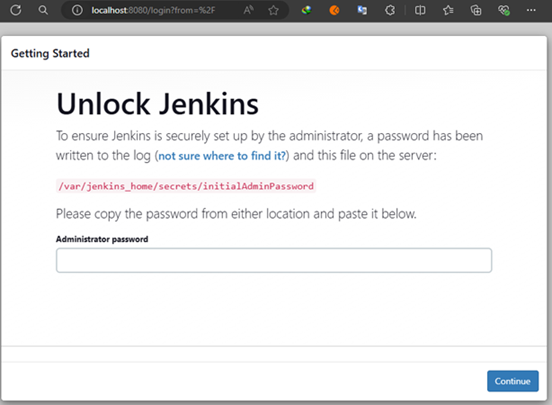
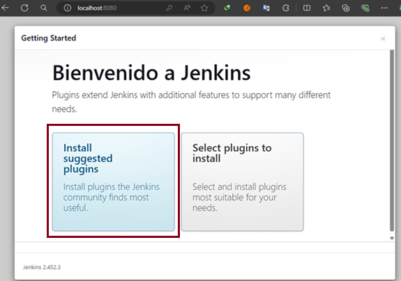
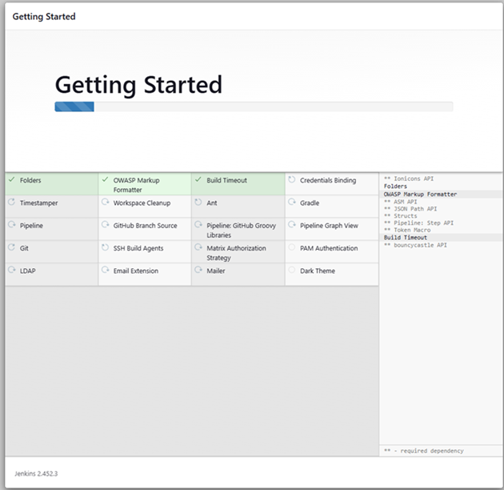
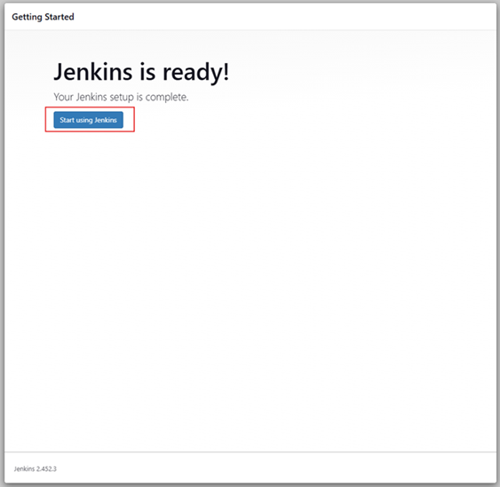
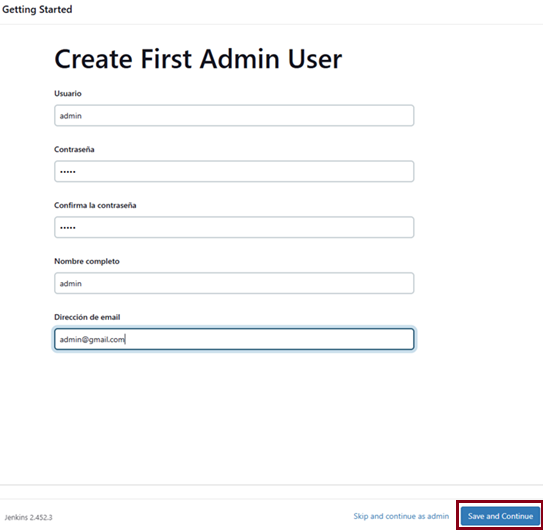
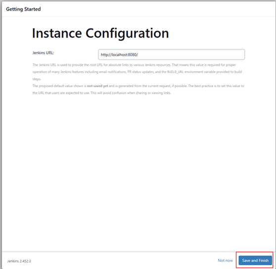
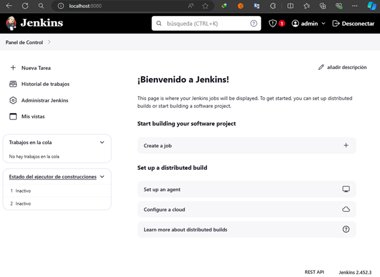

# La Guía de Jenkins: ¡De Cero a Experto! | Julio 2024

Curso tomado de Udemy de Julián Mac Loughlin

---

## Instalación de Jenkins en Docker

Vamos a utilizar `Docker` para trabajar con `Jenkins`. A continuación se muestran enlaces que utilicé.

- [Imagen de Jenkins en Docker Hub](https://hub.docker.com/r/jenkins/jenkins)
- [Documentación en GitHub de Jenkins](https://github.com/jenkinsci/docker/blob/master/README.md)
- [Página oficial de Jenkins](https://www.jenkins.io/)

Para la creación del servicio de `Jenkins` en el archivo de `compose.yml` vamos a guiarnos tanto del curso como de
repositorio de [GitHub](https://github.com/jenkinsci/docker/blob/master/README.md) donde se muestran formas de crear
contenedores de Jenkins.

A continuación se muestra el archivo `compose.yml` donde creamos el servicio de `Jenkins` usando un volumen con nombre
llamado `jenkins_home`:

````yml
services:
  jenkins:
    image: jenkins/jenkins:lts-jdk17
    container_name: c-jenkins
    ports:
      - 8080:8080
      - 50000:50000
    volumes:
      - jenkins_home:/var/jenkins_home
    restart: on-failure
    networks:
      - jenkins_net

volumes:
  jenkins_home:
    name: jenkins_home

networks:
  jenkins_net:
    name: jenkins_net
````

**Nota 1**
> Evite usar un `bind mount` (montaje de enlace) desde una carpeta en la máquina host a `/var/jenkins_home`, ya que esto
> podría generar problemas de permisos de archivo (el usuario utilizado dentro del contenedor podría no tener derechos
> para la carpeta en la máquina host). Si realmente necesita un `bind mount` (montaje de enlace) `jenkins_home`,
> asegúrese de que el directorio en el host sea accesible para el usuario jenkins dentro del contenedor (usuario
> jenkins - uid 1000) o use el parámetro -u some_other_user con docker run.

**Nota 2**
> Como observamos en el archivo `compose.yml` estoy usando un volúmen con nombre llamado `jenkins_home`.
> En el curso, el tutor usa un `bind mount` (son volúmenes que se montan desde el sistema de archivos del host. Permiten
> que un directorio o archivo del host sea utilizado directamente dentro del contenedor), además algunas configuraciones
> para otorgar privilegios.

Ahora, procedemos a ejecutar el archivo `compose.yml` con el siguiente comando. Notar que estamos ejecutando el comando
en la ruta donde está el archivo `compose.yml`:

````bash
M:\PROGRAMACION\DESARROLLO_JENKINS\01.udemy_la_guia_de_jenkins (main)

$ docker compose up -d
                                               
[+] Running 3/3                                                      
 ✔ Network jenkins_net    Created                                    
 ✔ Volume "jenkins_home"  Created                                    
 ✔ Container c-jenkins    Started                                    
````

Una vez finalizado la creación del servicio, revisamos los contenedores y observamos que está nuestro contenedor
creado correctamente:

````bash
$ docker container ls -a
CONTAINER ID   IMAGE                       COMMAND                  CREATED          STATUS          PORTS                                              NAMES
c32679e33728   jenkins/jenkins:lts-jdk17   "/usr/bin/tini -- /u…"   14 seconds ago   Up 12 seconds   0.0.0.0:8080->8080/tcp, 0.0.0.0:50000->50000/tcp   c-jenkins
````

Procedemos a abrir `jenkins` en el navegador a través de la url `http://localhost:8080`, observamos que nos sale la
siguiente pantalla:



La página nos muestra el siguiente mensaje:

> Para garantizar que el administrador configure Jenkins de forma segura, se ha escrito una contraseña en el registro
> (¿no está seguro de dónde encontrarla?) y este archivo en el servidor:
>
> `/var/jenkins_home/secrets/initialAdminPassword`
>
> Copie la contraseña de cualquiera de las ubicaciones y péguela a continuación.

Entonces, para ubicar la contraseña, optaremos por entrar en el contenedor de `jenkins` y navegar hacia la ruta
mostrada para ver el contenido del archivo `initialAdminPassword`.

````bash
$ docker container exec -it c-jenkins /bin/sh

$ cd /var/jenkins_home/secrets
$ ls
initialAdminPassword  jenkins.model.Jenkins.crumbSalt  master.key
$ cat initialAdminPassword
5b617b3ded6e4713a40b548dcabbe422
````

Observamos que la contraseña que nos han creado es `5b617b3ded6e4713a40b548dcabbe422`, lo ingresamos en la interfaz
anterior y damos en `Continue`, como consecuencia se nos mostrará la pantalla de `Bienvenido a Jenkins` donde
seleccionamos `instalar los plugins recomendados`.



A continuación, se mostrará la instalación de los plugins que nos ha recomendado, solo tenemos que esperar a que
finalice la instalación.



Ahora, nos pedirá que creemos un primer usuario administrador, en mi caso crearé al usuario `admin` cuya contraseña
también será `admin`.



A continuación nos mostrará la siguiente ventana donde simplemente damos clic en el botón `Save and Finish`.



Finalmente, obtenemos la pantalla de listo, podemos iniciar Jenkins.


Luego de dar clic en el botón de `Start using Jenkins` somos redirigidos al panel de `Jenkins`.


